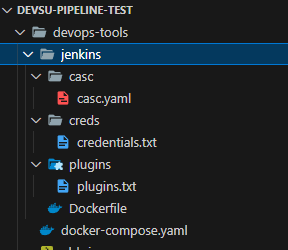
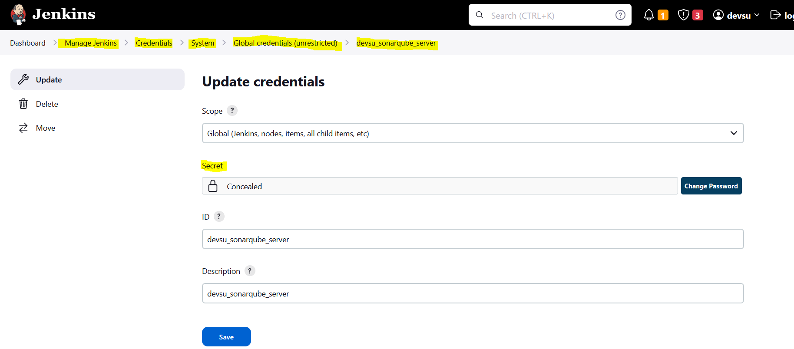
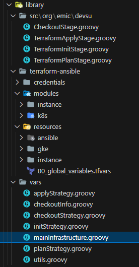
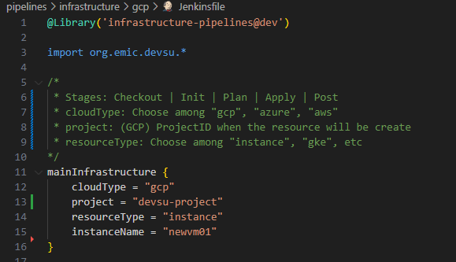

# Devsu - DevOps - Prueba Técnica

## 1. Overview
Este es un proyecto realizado en el marco del proceso de Selección de Devsu.

- Autor: Eldo M. Ingaruca Cruzado

El proyecto quiere representar una serie de automatismos para desplegar infraestructura en diferentes proveedores Cloud, configuración de dichos recursos y un ciclo de CI/CD de aplicaciones de Java, Node.js y Python.

La presente documentación hará énfasis, primero, en el despliegue y configuración de la infraestructura y luego abarcaremos el ciclo completo de CI/CD.

## 1.1 Importante - Ejecución Local *Jenkins & Sonarqube*
Esta es una versión de demostración, se ha querido diseñar la solución lo más portable posible, por lo que si desea probar este proyecto, puede utilizar la carpeta **devops-tools** que despliega un contenedor de Jenkins y otro de Sonarqube con las configuraciones necesarias para correr este proyecto localmente.

### 1.1.1 Requisitos:
  - docker & docker compose

### 1.1.2 Descripción:


- **docker-compose.yaml**: 
  - Despliega un contenedor **Sonarqube** con la configuración más básica posible. Sin volúmenes ni Postgre SQL. Para esta etapa de demostración, no hace falta.
  - Despliega un contenedor **Jenkins** utilizando un Dockerfile personalizado.
    - **casc/casc.yaml**: Se utiliza Configurations as Code de Jenkins para desplegar el contenedor con las credenciales necesarias, estructura de proyectos y repositorios a utilizar. Altamente portable.
    - **creds/credentials.txt**: Credenciales básicas para el proyecto se utilizarán en casc.yaml.
    - **plugins/plugins.txt**: Los plugins necesarios que se instalaran desde el Dockerfile.

### 1.1.3 Uso:

Si bien, se ha conseguido llevar gran parte de la configuración, existen unas pocas configuraciones extras que hay que hacer una vez desplegados los contenedores.

Uso básico:

Desde la carpeta **devops-tools**:

```
docker compose up -d
```
Una vez arrancados, ejecutar los siguientes comandos
```
docker exec -ti jenkins curl -u admin:admin -X POST "http://sonarqube:9000/api/users/change_password?login=admin&previousPassword=admin&password=devsu2024"
```
El token generado siguiente comando, tiene que ser utilizada en Jenkins
```
curl -u admin:devsu2024 -X POST "http://sonarqube:9000/api/user_tokens/generate?login=admin&name=testToken"
```
Cambio en Jenkins:


## 2. Infraestrctura

## 1.1

## 3. Pipelines
### 1.1 Introducción
Se ha querido dar un enfoque total. Crear una librería escrita en Groovy para Jenkins que sea escalable. Utilizando una estructura similar para diferentes tipos de proyectos, clouds y recursos.

Link: https://github.com/eingaruca/devsu-pipeline-test/tree/main/pipelines/infrastructure/library

Tecnologías utilizadas:
  - Jenkins pipelines
  - Groovy
  - Terraform
  - Ansible

### 1.2 Pipeline


Tal como se puede ver en el gráfico, se ha creado la librería Groovy que tendrá que utilizar cada Jenkinsfile. Esta librería aporta 5 etapas al pipeline.
- **Checkout Stage**: Obligatorio y necesario para el workspace.
- **Terraform Init Stage**: Etapa común a cualquier inicialización de un proyecto Terraform.
- **Terraform Plan Stage**: Terraform plan. Recibirá diferentes parámetros del Jenkinsfile que lo llevarán a las diferentes estrategias:
  - **GCP Strategy**: Recibirá el tipo de recurso, proyecto, nombre de recurso y se ampliará en el futuro a ciertos parámetros más personalizables.
  - **Azure Strategy**: No implementado, mejora futura.
  - **AWS Strategy**: No implementado, mejora futura.
- **Terraform Apply Stage**: Terraform apply. Igual que la etapa anterior, recibirá parámetros que condicionarán su comportamiento o estrategia.
  - **GCP Strategy**: Recibirá el tipo de recurso, proyecto, nombre de recurso y se ampliará en el futuro a ciertos parámetros más personalizables.
  - **Azure Strategy**: No implementado, mejora futura.
  - **AWS Strategy**: No implementado, mejora futura.
- **Post Stage**: Limpieza del workspace

### 1.3 Estructura de clases:



- La clase principal es **mainInfrastructure.groovy**, que recibirá los parámetros que determinarán el comportamiento/estrategia del pipeline.

- La carpeta **src/org/emic/devsu** ejecuta la estrategia dependiendo de los parámetros recibidos (Tipo de proveedor Cloud, tipo de recurso, etc) y llama a las clases que se encuentran en la carpeta vars.
- La carpeta **vars** ejecuta finalmente las acciones como init, plan o apply recibirá parámetros de los stage de la carpeta **src**.
- La carpeta **terraform-ansible**:
  - **credentials**: Las credenciales para los clouds
  - **modules**: Se ha creado módulos personalizados para el despliegue de recursos.
  - **resources**: Utiliza los módulos creados antes, indica variables por defecto para que si el usario sólo indica el nombre del recurso, el pipeline se encargue de crear dicho recurso con valores por defecto.
    - **ansible**: Adicionalmente, en la carpeta de instancias, se han creado playbooks de ansible que instalan y configuran los recusos necesarios para la configuración de la instancia **[[[[[[[[[[[[[ REVISAR ]]]]]]]]]]]]]**.

### 1.4 Uso Básico
Jenkinsfile:



El uso desde un Jenkinsfile es muy sencillo. 
- Indicar la librería previamente configurada en Jenkins:

  ```
  @Library('infrastructure-pipelines@dev')
  import org.emic.devsu.*
  ```
- Indicar el comportamiento llamando la mainInfrastructure. En este caso, se indica que será para Google Cloud, al proyecto devsu-project, el recurso será una VM instancia y el nombre newvm01:
  ```
  mainInfrastructure {
      cloudType = "gcp"
      project = "devsu-project"
      resourceType = "instance"
      instanceName = "newvm01"
  }
  ```
  Los demás parámetros necesarios los completan los scripts de terraform que utilizan los módulos. 


Consta de tres etapas muy marcadas.

- Despliegue infrastructura
  - IaC
    - Google cloud
      - 


#