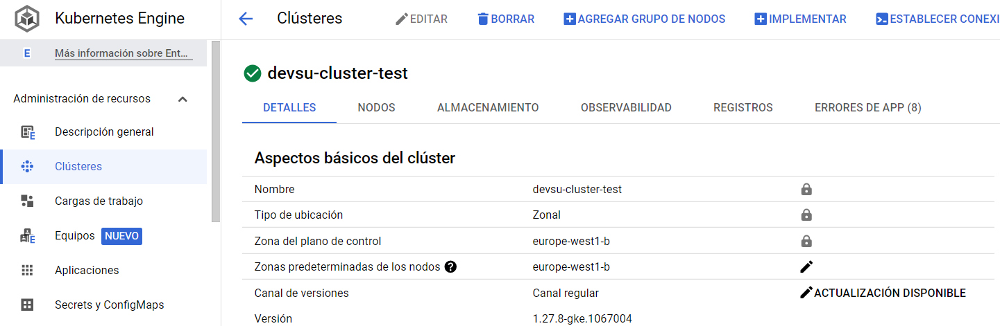

# Devsu - DevOps - Prueba Técnica

## 1. Overview
Este es un proyecto realizado en el marco del proceso de Selección de Devsu.

- Autor: Eldo M. Ingaruca Cruzado

El proyecto quiere representar una serie de automatismos para desplegar infraestructura en diferentes proveedores Cloud, configuración de dichos recursos y un ciclo de CI/CD de aplicaciones de Java, Node.js y Python.

La presente documentación hará énfasis, primero, en el despliegue y configuración de la infraestructura y luego abarcaremos el ciclo completo de CI/CD.

El código de la solución se encuentra en:

- Pipelines y aprovisionamiento: https://github.com/eingaruca/devsu-pipeline-test.
- Proyectos de Devsu, adaptados para que utilicen Dockerfile, manifiestos yaml y cloud-build.yaml:
  - https://github.com/eingaruca/demo-devops-java
  - https://github.com/eingaruca/demo-devops-nodejs
  - https://github.com/eingaruca/demo-devops-python

## 1.1 Entorno Cloud (Google Cloud) 

### 1.1.1 Jenkins, SonarQube y GKE
Se ha aprovisionado una VM Instance en Google Cloud.

- Jenkins:
  ```
  http://34.77.120.197:8080/

  Usuario: devsu
  Password: devsu
  ```
- SonarQube:
  ```
  http://34.77.120.197:9000/

  Usuario: admin
  Password: devsu2024
  ```

También se ha aprovisionado un Clúster de Googke Kubernetes Engine.


### 1.1.2 Google Cloud Build
Existe una segunda vía de ejecución de un pipeline de Devops. Es un valor agregado a esta guía, para información, haga click [aquí](cloud-build.md).


## 1.2 Entorno Local *Jenkins & Sonarqube*
También se han generado los scripts para que puedan ejecutar SonarQube y Jenkins con las configuraciones necesarias en su entorno local. Si desea hacerlo, puede seguir la siguiente guía:

[Ejecución Local](devops-tools/README.md)

## 2. Infraestructura

Recordar que si desean una explicación más detallada de la solución utilizando Cloud Build, haga click [aquí](cloud-build.md). 

### 2.1 Introducción

A continuación se explicará la solución utilizando una Virtual Machine, Jenkins, SonarQube, GKE, etc.

### 2.2 Diagrama


Para la solución se ha utilizado:
- Jenkins
- Sonarqube
- Docker containers
- Docker Hub Registry
- Google Cloud
  - Google Compute Instance: Instancias
  - Google Kubernetes Engine: GKE

### 2.3 Despliegue 

El despliegue de la solución constó de 2 etapas:
- El aprovisionamiento de Jenkins y SonarQube se realizó con docker compose: https://github.com/eingaruca/devsu-pipeline-test/tree/main/devops-tools
- Aprovisionamiento el Google Cloud de la instancia y GKE Clúster utilizando scripts los módulos de terraform.

## 3. Pipelines Infraestructura (Google Cloud & Ansible)

Para ver las pruebas de ejecución de deste pipeline: [Click aquí](stage-infrastructure.md).

### 3.1 Introducción
Se ha querido dar un enfoque total. Crear una librería escrita en Groovy para Jenkins que sea altamente escalable y adaptable. Utilizando una estructura similar para diferentes tipos de proveedores (Mejora futura ampliara AWS y Azure):

- Cloud: https://github.com/eingaruca/devsu-pipeline-test/tree/main/pipelines/infrastructure/library

Tecnologías utilizadas:
  - Jenkins pipelines & Plugins
  - Groovy
  - Terraform
  - Ansible

### 3.2 Pipeline


Tal como se puede ver en el gráfico, se ha creado una librería en Groovy que tendrá que utilizar cada Jenkinsfile. Esta librería aporta estas etapas al pipeline.
- **Checkout Stage**: Obligatorio y necesario para el workspace.
- **Terraform Init Stage**: Etapa común a cualquier inicialización de un proyecto Terraform.
- **Terraform Plan Stage**: Terraform plan. Recibirá diferentes parámetros del Jenkinsfile que lo llevarán a las diferentes estrategias:
  - **GCP Strategy**: Recibirá el tipo de recurso, proyecto, nombre de recurso y se ampliará en el futuro a ciertos parámetros más personalizables.
  - **Azure Strategy**: *No implementado, mejora futura.*
  - **AWS Strategy**: *No implementado, mejora futura.*
- **Terraform Apply Stage**: Terraform apply. Igual que la etapa anterior, recibirá parámetros que condicionarán su comportamiento o estrategia.
  - **GCP Strategy**: Recibirá el tipo de recurso, proyecto, nombre de recurso y se ampliará en el futuro a ciertos parámetros más personalizables.
  - **Azure Strategy**: *No implementado, mejora futura.*
  - **AWS Strategy**: *No implementado, mejora futura.*
- **Post Stage**: Buenas prácticas. Proximamente.

### 3.3 Estructura de clases:


- La clase principal es **mainInfrastructure.groovy**, que recibirá los parámetros que determinarán el comportamiento/estrategia del pipeline.

- La carpeta **src/org/emic/devsu** ejecuta la estrategia dependiendo de los parámetros recibidos (Tipo de proveedor Cloud, tipo de recurso, etc) y llama a las clases que se encuentran en la carpeta vars.
- La carpeta **vars** ejecuta finalmente las acciones como init, plan o apply recibirá parámetros de los stage de la carpeta **src**.
- La carpeta **terraform-ansible**:
  - **credentials**: Las credenciales para los clouds
  - **modules**: Se ha creado módulos personalizados para el despliegue de recursos.
  - **resources**: Utiliza los módulos creados antes, indica variables por defecto para que si el usario sólo indica el nombre del recurso, el pipeline se encargue de crear dicho recurso con valores por defecto.
    - **ansible**: Se han preparado un Playbook para la instalación de paquetes.

### 3.4 Uso Básico
Jenkinsfile:


El uso desde un Jenkinsfile es muy sencillo. 
- Indicar la librería previamente configurada en Jenkins:

  ```
  @Library('infrastructure-pipelines@dev')
  import org.emic.devsu.*
  ```
- Indicar el comportamiento llamando la mainInfrastructure. En este caso, se indica que será para Google Cloud, al proyecto devsu-project, el recurso será una VM instancia y el nombre newvm01:
  ```
  mainInfrastructure {
      cloudType = "gcp"
      project = "devsu-project"
      resourceType = "instance"
      instanceName = "newvm01"
  }
  ```
  Los demás parámetros necesarios los completan los scripts de terraform que utilizan los módulos. 

### 3.5 Mejoras futuras
- Estandarizar los valores por defecto de los módulos.
- Subir el tfstate a un Bucket.
- Ampliar las funcionalidades a diferentes proveedores Cloud.
- Integrar Ansible al desplegar instancias.

## 4. Pipeline Ciclo DevOps Aplicaciones (demo-app-*)

**IMPORTANTE:**
Para ver las pruebas de ejecución de deste pipeline: [Click aquí](stage-pipeline.md).

### 4.1 Introducción
También, se ha querido dar un enfoque total. Se ha creado una librería escrita en Groovy para Jenkins que sea escalable y adaptable conforme vayan surgiendo las necesidades. Se ha previsto el uso de estrategias en el pipeline para proyectos java (springboot), nodejs y python (Django). El uso de contenedores en algunas etapas (Stages), permite que se dependa muy poco del entorno sobre el que se ejecuta y es el primer paso para llevarlo a orquestadores de microservicios como Kubernetes u Openshift.

Se ha "modularizado" las diferentes etapas, por lo que si un Stage, un Strategy o alguna función interna de cada una de estas necesita reforzarce o ampliarse, puede hacerse limpiamente sin afectar el script principal, incluso permitiendo que se pueda trabajar en paralelo en diferentes Stages.

Si bien, aprender el uso inicial del Jenkinsfile puede implicar un ligero esfuerzo inicial, se convierte en una herramienta potente, sencilla y adaptable a diferentes proyectos.

### 4.2 Pipeline


El pipeline se ha parametrizado para ejecutarse en base a 2 factores:
- **Tipo de Proyecto**. El pipeline admite proyectos en nodejs, python y java. La estrategia cambia dependiendo de ese parámetro.
- **Tipo de Stage**. Desde el Jenkinsfile puedo indicar si necesito que alguna etapa se ejecute, siendo obligatorias el Checkout Stage y Build Stage. Todas las demás son opcionales. Esto permite adaptarse de muchos requerimientos y por lo mismo, escalable y ampliable a una branchStrategy (Mejora para el futuro).

En cuanto a los Stages o etapas, esta es una breve descripción de cada una:

- **Checkout Stage**: Obligatorio y común a todo tipo de proyecto, no hace falta parametrizarlo.
- **Build Stage**: Obligatorio. Dependiendo del tipo de proyecto realiza un build de manera diferente. Realiza el build en un contenedor docker, que se crea y destruye, para no utilizar configuración del servidor (Contenedor) de Jenkins.
- **Test Stage**: Opcional. *ArrayList*. Si no se espefica, no se ejecuta. Pero si se espefica, hay que indicarle que tipo de pruebas necesitamos. Se hacen las pruebas sobre contenedores docker (Se crean y destruyen) para no depender de la configuración de Jenkins. Hay tres tipos de pruebas:
  - **Unitarias**: *Boolean*. Realiza la prueba. Si no existe para el tipo de Proyecto, lo indica en el output del pipeline.
  - **Aceptación**: *Boolean*. Realiza la prueba. Si no existe para el tipo de Proyecto, lo indica en el output del pipeline.
  - **Integración**: *Boolean*. Realiza la prueba. Si no existe para el tipo de Proyecto, lo indica en el output del pipeline.
- **Code Analysis Stage**: *Boolean*. Si es true, utiliza el tipo de proyecto para realizar el análisis de código estático buscando el proyecto específico en el contenedor de Sonarqube previamente desplegado simulando un servidor de Sonarqube.
- **Code Coverage Stage**: *Boolean*. Si es true, utiliza el tipo de proyecto para realizar el análisis de código estático buscando el proyecto específico en el contenedor de Sonarqube previamente desplegado simulando un servidor de Sonarqube.
- **Delivery Stage**: *Boolean*. Si es true, realiza el build y push del Dockerfile de cada proyecto , dependiendo del Tipo de Proyecto, sobre el repositorio de DockerHub.
- **Deployment Stage**: *Boolean*. Si es true, utiliza una imagen oficial de GCP para crear un contenedor, se realiza de esta forma por seguridad. Así evitamos cualquier configuración en el servidor (Contenedor) de Jenkins:
  - Hace login al clúster de GKE. 
  - Borra recursos utilizando el manifiesto en el proyecto.
  - Aplica el manifiesto ubicado en cada proyecto. Se asegura la integridad del pod para que el Ingress pueda ofrecer disponibilidad.
    - Deployment: 
      - Replicas: 2
      - LivenessProbe
      - readinessProbe
    - Service:
      - Type: NodePort
    - Ingress: Un Ingress por cada Service (python, java y nodejs)
      - PathType: Prefix
      - gce: Genera un Load Balancer en GC con objetos tipos Backend.
  - Realiza una comprobación (kubectl get pods) para comprobar que los pods estén ejecutándose.
- **Post Stage**: Buenas prácticas. [Proximamente].

### 4.3 Estructura de clases


- La clase principal es **mainPipeline.groovy**, que recibirá los parámetros que determinarán el comportamiento/estrategia del pipeline.

- La carpeta **src/org/emic/devsu** contiene las Stages y ejecuta la estrategia dependiendo de los parámetros recibidos (Tipo de proyecto springboot, nodejs, django). Llama a las clases que se encuentran en la carpeta vars. Existe una clase groovy por cada Stage configurado en el proyecto.
- La carpeta **vars** ejecuta finalmente los Stages. Recibirá parámetros de los stage de la carpeta **src**.
### 4.4 Uso Básico

Jenkinsfile:


El uso desde un Jenkinsfile es muy sencillo. 
- Indicar la librería previamente configurada en Jenkins:

  ```
  @Library('devops-pipelines@dev')
  import org.emic.devsu.*
  ```
- Indicar el comportamiento llamando la mainPipeline. En este caso:
  - La estrategia se centrará en procesar un proyecto springboot.
  - Realizará los 3 tipos de pruebas.
  - Realizará los Stages de codeCoverage, Delivery y Deploy.
  ```
  mainPipeline {
    projectType = "springboot"
    test = [true, true, true]
    codeAnalysis = true
    codeCoverage = true
    delivery = true
    deploy = true
  }
  ```
  
  - La ventaja del esta estructura es que es fácil de escalar, se liberan las clases de lógica y funcionalidad permitiendo crecer ordenadamente.

  Ejemplo de pruebas:

  
### 4.5 Mejoras futuras
- Adaptar el deploy para poder desplegar en diferentes infraestructuras, como por ejemplo, Openshift, Clústers locales, Docker compose, diferentes proveedores de Cloud.
- Gestionar una estrategia de Ramas.