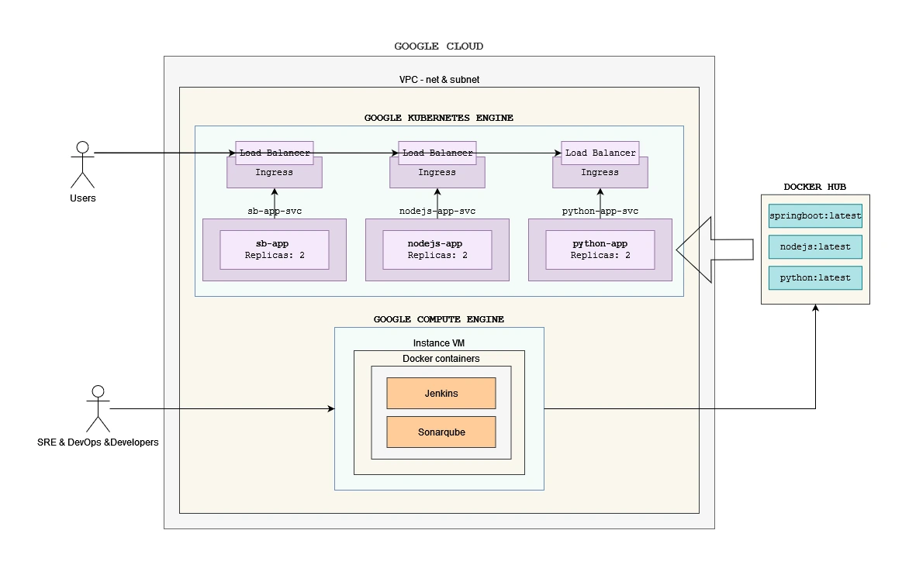

# Devsu - DevOps - Prueba Técnica

## 1. Overview
Este es un proyecto realizado en el marco del proceso de Selección de Devsu.

- Autor: Eldo M. Ingaruca Cruzado

El proyecto quiere representar una serie de automatismos para desplegar infraestructura en diferentes proveedores Cloud, configuración de dichos recursos y un ciclo de CI/CD de aplicaciones de Java, Node.js y Python.

La presente documentación hará énfasis, primero, en el despliegue y configuración de la infraestructura y luego abarcaremos el ciclo completo de CI/CD.

## 1.1 Importante - Ejecución Local *Jenkins & Sonarqube*
Esta es una versión de demostración, se ha querido diseñar la solución lo más portable posible, por lo que si desea probar este proyecto, puede utilizar la carpeta **devops-tools** que despliega un contenedor de Jenkins y otro de Sonarqube con las configuraciones necesarias para correr este proyecto localmente.

### 1.1.1 Requisitos:
  - docker & docker compose

### 1.1.2 Descripción:


- **docker-compose.yaml**: 
  - Despliega un contenedor **Sonarqube** con la configuración más básica posible. Sin volúmenes ni Postgre SQL. Para esta etapa de demostración, no hace falta.
  - Despliega un contenedor **Jenkins** utilizando un Dockerfile personalizado.
    - **casc/casc.yaml**: Se utiliza Configurations as Code de Jenkins para desplegar el contenedor con las credenciales necesarias, estructura de proyectos y repositorios a utilizar. Altamente portable.
    - **creds/credentials.txt**: Credenciales básicas para el proyecto se utilizarán en casc.yaml.
    - **plugins/plugins.txt**: Los plugins necesarios que se instalaran desde el Dockerfile.

### 1.1.3 Uso:

Si bien, se ha conseguido llevar gran parte de la configuración, existen unas pocas configuraciones extras que hay que hacer una vez desplegados los contenedores.

Uso básico:

Desde la carpeta **devops-tools**:

```
docker compose up -d
```
Una vez arrancados, ejecutar los siguientes comandos
```
docker exec -ti jenkins curl -u admin:admin -X POST "http://sonarqube:9000/api/users/change_password?login=admin&previousPassword=admin&password=devsu2024"
```
El token generado siguiente comando, tiene que ser utilizada en Jenkins
```
curl -u admin:devsu2024 -X POST "http://sonarqube:9000/api/user_tokens/generate?login=admin&name=testToken"
```
**[[[[[[[[[[[[[[[ Crear proyectos por comando ]]]]]]]]]]]]]]]**
Cambio en Jenkins:


Finalizado esto, podremos ver nuestro jenkins levantado y ejecutar los pipelines de devops-stages o de infrastructure:


### 1.4 Log de ejecución previa:
- Logs de la ejecución de este paso: [Log](Log-devops-tools.md)

## 2. Infraestructura
### 2.1 Introducción
La intención de la infraestructura desplegada es que pueda utilizarse en diferentes entornos. 

### 2.2 Diagrama


Para la solución se ha utilizado:
- Jenkins
- Sonarqube
- Docker containers
- Docker Hub Registry
- Google Cloud
  - Google Compute Instance: Instancias
  - Google Kubernetes Engine: GKE

### 2.3 Despliegue 

El despliegue de la solución constó de 2 etapas:
- Aprovisionamiento el Google Cloud de la instancia y GKE Clúster utilizando scripts los módulos de terraform.
  - Ruta: **[[[[[[[[[[[[[[[ Indicar ruta de los scripts Terraform]]]]]]]]]]]]]]]**
  - Log: Aquí


## 3. Pipelines Infraestructura
### 3.1 Introducción
Se ha querido dar un enfoque total. Crear una librería escrita en Groovy para Jenkins que sea escalable. Utilizando una estructura similar para diferentes tipos de proyectos, clouds y recursos.

Link: https://github.com/eingaruca/devsu-pipeline-test/tree/main/pipelines/infrastructure/library

Tecnologías utilizadas:
  - Jenkins pipelines
  - Groovy
  - Terraform
  - Ansible

### 3.2 Pipeline


Tal como se puede ver en el gráfico, se ha creado la librería Groovy que tendrá que utilizar cada Jenkinsfile. Esta librería aporta 5 etapas al pipeline.
- **Checkout Stage**: Obligatorio y necesario para el workspace.
- **Terraform Init Stage**: Etapa común a cualquier inicialización de un proyecto Terraform.
- **Terraform Plan Stage**: Terraform plan. Recibirá diferentes parámetros del Jenkinsfile que lo llevarán a las diferentes estrategias:
  - **GCP Strategy**: Recibirá el tipo de recurso, proyecto, nombre de recurso y se ampliará en el futuro a ciertos parámetros más personalizables.
  - **Azure Strategy**: No implementado, mejora futura.
  - **AWS Strategy**: No implementado, mejora futura.
- **Terraform Apply Stage**: Terraform apply. Igual que la etapa anterior, recibirá parámetros que condicionarán su comportamiento o estrategia.
  - **GCP Strategy**: Recibirá el tipo de recurso, proyecto, nombre de recurso y se ampliará en el futuro a ciertos parámetros más personalizables.
  - **Azure Strategy**: No implementado, mejora futura.
  - **AWS Strategy**: No implementado, mejora futura.
- **Post Stage**: Limpieza del workspace

### 3.3 Estructura de clases:


- La clase principal es **mainInfrastructure.groovy**, que recibirá los parámetros que determinarán el comportamiento/estrategia del pipeline.

- La carpeta **src/org/emic/devsu** ejecuta la estrategia dependiendo de los parámetros recibidos (Tipo de proveedor Cloud, tipo de recurso, etc) y llama a las clases que se encuentran en la carpeta vars.
- La carpeta **vars** ejecuta finalmente las acciones como init, plan o apply recibirá parámetros de los stage de la carpeta **src**.
- La carpeta **terraform-ansible**:
  - **credentials**: Las credenciales para los clouds
  - **modules**: Se ha creado módulos personalizados para el despliegue de recursos.
  - **resources**: Utiliza los módulos creados antes, indica variables por defecto para que si el usario sólo indica el nombre del recurso, el pipeline se encargue de crear dicho recurso con valores por defecto.
    - **ansible**: Adicionalmente, en la carpeta de instancias, se han creado playbooks de ansible que instalan y configuran los recusos necesarios para la configuración de la instancia **[[[[[[[[[[[[[ REVISAR ]]]]]]]]]]]]]**.

### 3.4 Uso Básico
Jenkinsfile:


El uso desde un Jenkinsfile es muy sencillo. 
- Indicar la librería previamente configurada en Jenkins:

  ```
  @Library('infrastructure-pipelines@dev')
  import org.emic.devsu.*
  ```
- Indicar el comportamiento llamando la mainInfrastructure. En este caso, se indica que será para Google Cloud, al proyecto devsu-project, el recurso será una VM instancia y el nombre newvm01:
  ```
  mainInfrastructure {
      cloudType = "gcp"
      project = "devsu-project"
      resourceType = "instance"
      instanceName = "newvm01"
  }
  ```
  Los demás parámetros necesarios los completan los scripts de terraform que utilizan los módulos. 

## 4. Pipeline Ciclo DevOps (demo-app-*)

### 4.1 Introducción
También, se ha querido dar un enfoque total. Se ha creado una librería escrita en Groovy para Jenkins que sea escalable. Se ha adaptado las estrategias del pipeline para proyectos java (springboot), nodejs y python (Django). El uso de contenedores, permite que se dependa muy poco del entorno sobre el que se ejecuta y es el primer paso para llevarlo a orquestadores de microservicios como Kubernetes u Openshift.

Se ha "modularizado" las diferentes etapas, por lo que si un Stage, un Strategy o alguna función interna de cada una de estas necesita reforzarce o ampliarse, puede hacerse limpiamente sin afectar a el script principal, incluso permitiendo que se pueda trabajar en paralelo en diferentes Stages.

Si bien, aprender el uso inicial del Jenkinsfile puede implicar un poco de esfuerzo, se convierte en una herramienta potente sencilla y adaptable a diferentes proyectos.

### 4.2 Pipeline


El pipeline se ha parametrizado para ejecutarse en base a 2 factores:
- **Tipo de Proyecto**. El pipeline admite proyectos en nodejs, python y java. La estrategia cambia dependiendo de ese parámetro.
- **Tipo de Stage**. Desde el Jenkinsfile puedo indicar si necesito que alguna etapa se ejecute, siendo obligatorias el Checkout Stage y Build Stage. Todas las demás son opcionales. Esto permite adaptarse de muchos requerimientos y por lo mismo, escalable y ampliable a una branchStrategy (Mejora para el futuro).

En cuanto a los Stages o etapas, esta es una breve descripción de cada una:

- **Checkout Stage**: Obligatorio y común a todo tipo de proyecto, no hace falta parametrizarlo.
- **Build Stage**: Obligatorio. Dependiendo del tipo de proyecto realiza un build de manera diferente. Realiza el build en contenedor docker para no utilizar configuración del servidor (Contenedor) de Jenkins.
- **Test Stage**: Opcional. *ArrayList*. Si no se espefica, no se ejecuta. Pero si se espefica, hay que indicarle que tipo de pruebas necesitamos. Se hacen las pruebas sobre contenedores (Se crean y destruyen) docker para no depender de la configuración de Jenkins. Hay tres tipos de pruebas:
  - **Unitarias**: *Boolean*. Si no existe para el tipo de Proyecto, lo imprime en el output del pipeline.
  - **Aceptación**: *Boolean*. Si no existe para el tipo de Proyecto, lo imprime en el output del pipeline.
  - **Integración**: *Boolean*. Si no existe para el tipo de Proyecto, lo imprime en el output del pipeline.
- **Code Analysis Stage**: *Boolean*. Si es true, utiliza el tipo de proyecto para realizar el análisis de código estático buscando el proyecto específico en el contenedor de Sonarqube previamente desplegado simulando un servidor de Sonarqube.
- **Code Coverage Stage**: *Boolean*. Si es true, utiliza el tipo de proyecto para realizar el análisis de código estático buscando el proyecto específico en el contenedor de Sonarqube previamente desplegado simulando un servidor de Sonarqube.
- **Delivery Stage**: *Boolean*. Si es true, realiza el build y push del Dockerfile de cada proyecto , dependiendo del Tipo de Proyecto, sobre el repositorio de DockerHub.
- **Deployment Stage**: *Boolean*. Si es true, utiliza una imagen oficial de GCP para crear un contenedor, se realiza de esta forma por seguridad. Así evitamos cualquier configuración en el servidor (Contenedor) de Jenkins:
  - Hace login al clúster de GKE. 
  - Borra recursos utilizando el manifiesto en el proyecto.
  - Aplica el manifiesto.
  - Realiza una comprobación (kubectl get pods) para comprobar que los pods estén ejecutándose.
- **Post Stage**: Limpieza del workspace. **[[[[[[[Proximamente]]]]]]]**

### 4.3 Estructura de clases


- La clase principal es **mainPipeline.groovy**, que recibirá los parámetros que determinarán el comportamiento/estrategia del pipeline.

- La carpeta **src/org/emic/devsu** contiene las Stages y ejecuta la estrategia dependiendo de los parámetros recibidos (Tipo de proyecto springboot, nodejs, django). Llama a las clases que se encuentran en la carpeta vars. Existe una clase groovy por cada Stage configurado en el proyecto.
- La carpeta **vars** ejecuta finalmente los Stages. Recibirá parámetros de los stage de la carpeta **src**.
### 4.4 Uso Básico

Jenkinsfile:


El uso desde un Jenkinsfile es muy sencillo. 
- Indicar la librería previamente configurada en Jenkins:

  ```
  @Library('devops-pipelines@dev')
  import org.emic.devsu.*
  ```
- Indicar el comportamiento llamando la mainPipeline. En este caso:
  - La estrategia se centrará en procesar un proyecto springboot.
  - Realizará los 3 tipos de pruebas.
  - Realizará los Stages de codeCoverage, Delivery y Deploy.
  ```
  mainPipeline {
    projectType = "springboot"
    test = [true, true, true]
    codeAnalysis = true
    codeCoverage = true
    delivery = true
    deploy = true
  }
  ```
  
  - La ventaja del esta estructura es que es fácil de escalar, se liberan las clases de lógica y funcionalidad permitiendo crecer ordenadamente.