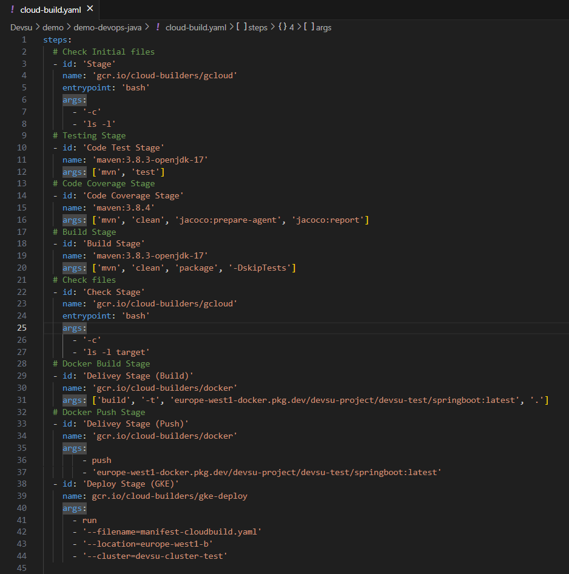
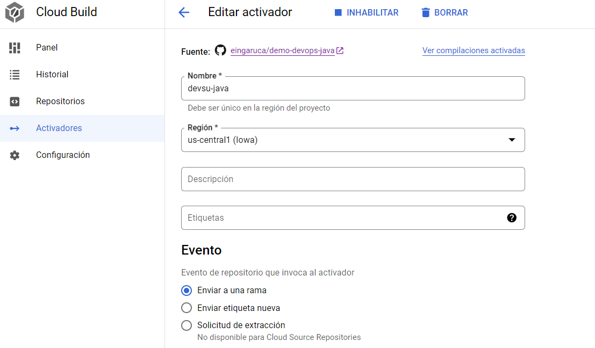
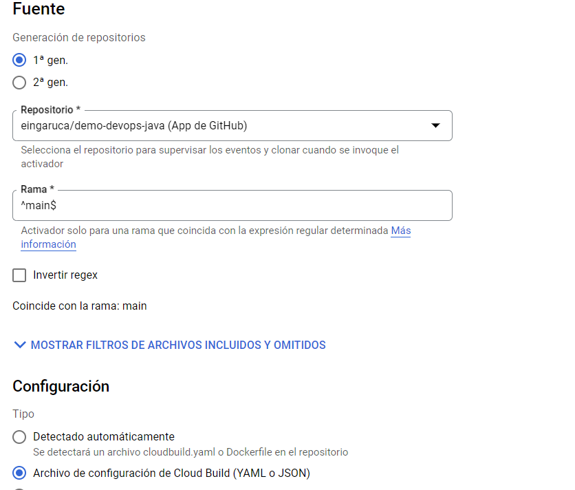
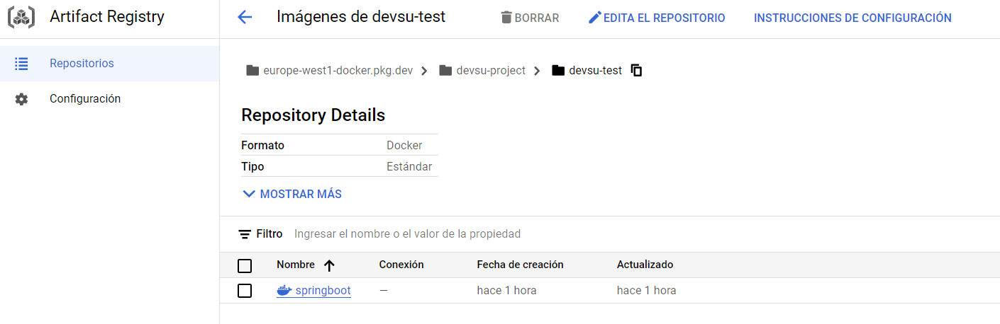
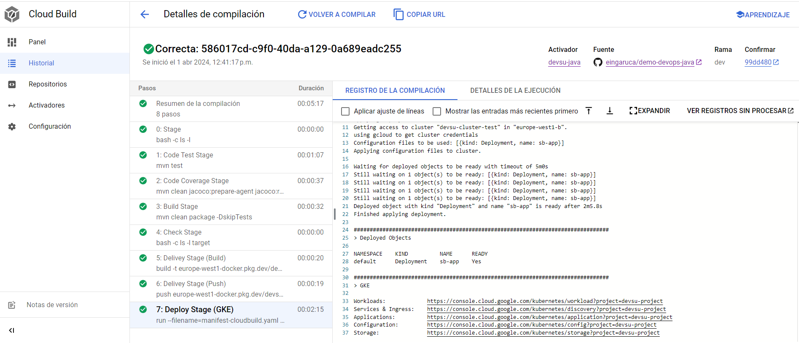

# Ciclo de DevOps sobre Google Cloud Build

## 1. Overview
Se ha querido realizar un segundo enfoque para un ciclo de DevOps y es utilizando los productos que ofrece Google Cloud.

Se han utilizado productos como:
- GitHub
- Cloud Build
- Artifact Repository
- Google Kubernetes Engine

## 2. Diagrama
[Pendiente]
## 3. Estructura de clases & Funcionamiento

En este caso, no hay una estructura de clases. La preparación de los Stages del ciclo de DevOps está en el fichero **cloud-build.yaml**. En este caso, sólo se encuentra en la raiz del proyecto de demo-devops-java: https://github.com/eingaruca/demo-devops-java. No se ha desarrollado otros pipelines (Node.js y Python).

Para que este pipeline funcione, hay que utilizar los Triggers que ofrece Cloud Build. Se establece una conexión con el repositorio, en este caso, demo-devops-java y se le indica que cada push sobre una determinada rama va a disparar el cloud-build.yaml que tenga el proyecto.

Se utiliza Artifact Registry para almacenar la imagen generada y se despliega utilizando manifest-cloudbuild.yaml para desplegarlo en el clúster de Kubernetes (GKE).

- Trigger - Configuración:

- Artifact Registry

## 4. Ejecución
Este es un ejemplo de ejecución y despliegue

Se puede revisar un ejemplo de la ejecución del pipeline: [Log](cloud-build-log.txt)

## 4. Mejoras futuras
- Estrategia de Ramas
- Mejor condicionamiento de los Stages
- Adaptarlo para diferentes proyectos (Node.js y Python)
- Adaptarlo para otros productos de Google Cloud