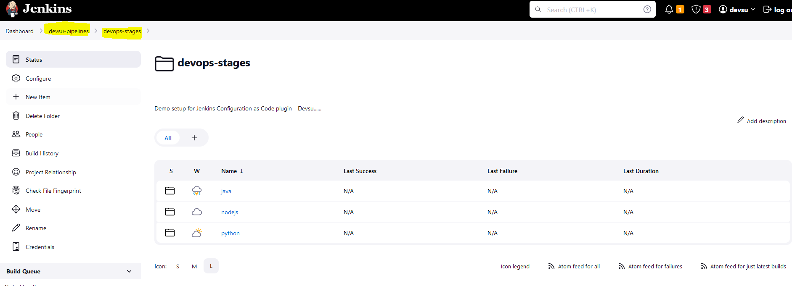
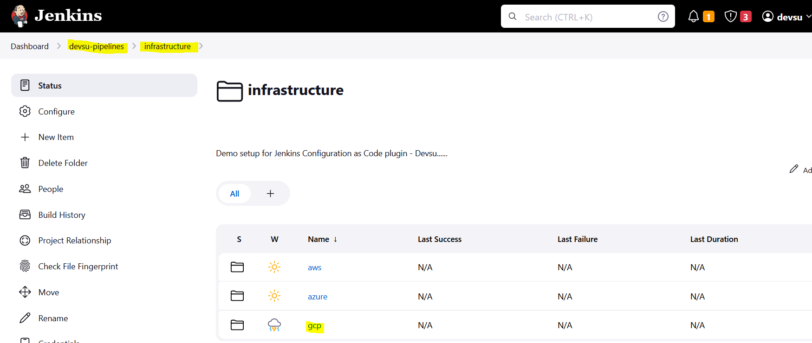

# Ejecución local del Entorno (Jenkins + SonarQube)

Esta es una versión de demostración, se ha querido diseñar la solución lo más portable posible, por lo que si desea probar este proyecto, puede utilizar la carpeta **devops-tools** que despliega un contenedor de Jenkins y otro de Sonarqube con las configuraciones necesarias para correr este proyecto localmente.

## 1. Requisitos
  - Tener instalado Docker & Docker compose

## 2. Descripción
El proyecto tiene la siguiente estructura:


- **docker-compose.yaml**: 
  - Despliega un contenedor **Sonarqube** con la configuración más básica posible. Sin volúmenes ni Postgre SQL. Para esta etapa de demostración, no hace falta.
  - Despliega un contenedor **Jenkins** utilizando un Dockerfile personalizado.
    - **casc/casc.yaml**: Se utiliza Configurations as Code de Jenkins para desplegar el contenedor con las credenciales necesarias, estructura de proyectos y repositorios a utilizar. Altamente portable.
    - **creds/credentials.txt**: Credenciales básicas para el proyecto se utilizarán en casc.yaml.
    - **plugins/plugins.txt**: Los plugins necesarios que se instalaran desde el Dockerfile.

## 3. Uso:

Si bien, se ha conseguido llevar gran parte de la configuración, existen unas pocas configuraciones extras que hay que hacer una vez desplegados los contenedores.

Uso básico:

### 3.1 Desplegar contenedores Jenkins y Sonarqube
Desde la carpeta **devops-tools**:

```
docker compose up -d
```
### 3.2 Configuración Sonarqube
Una vez arrancados, ejecutar los siguientes comandos para cambiar la contraseña y crear los proyectos de SonarQube:
```
docker exec -ti jenkins curl -u admin:admin -X POST "http://sonarqube:9000/api/users/change_password?login=admin&previousPassword=admin&password=devsu2024"

docker exec -ti jenkins curl -u admin:devsu2024 -X POST "http:/sonarqube:9000/api/projects/create?name=Java-Project&project=Java-Project&mainBranch=main"

docker exec -ti jenkins curl -u admin:devsu2024 -X POST "http://sonarqube:9000/api/projects/create?name=Python-Project&project=Python-Project&mainBranch=main"

docker exec -ti jenkins curl -u admin:devsu2024 -X POST "http://sonarqube:9000/api/projects/create?name=Nodejs-Project&project=Nodejs-Project&mainBranch=main"
```
### 3.3 Configuración Jenkins
El token generado siguiente comando, tiene que ser utilizado en Jenkins
```
docker exec -ti jenkins curl -u admin:devsu2024 -X POST "http://sonarqube:9000/api/user_tokens/generate?login=admin&name=testToken"


Jenkins: http://localhost:8080
Usuario: devsu
Password: devsu
```

Cambio en Jenkins:


Finalizado esto, podremos ver nuestro jenkins levantado y ejecutar los pipelines de devops-stages o de infrastructure:



## 4. Acceso
Los contenedores ejecutados en local son:
- Jenkins: 
    ```
    http://localhost:8080

    Usuario: devsu
    Password: devsu
    ```
- Sonarqube:
    ```
    http://localhost:9000
    
    Usuario: admin
    Password: devsu
    ```
## 5. Pruebas ejecución
### 5.1 Ejecución docker-compose.yaml


### 5.2 Ejemplo ejecución Pipeline:
Logs de la ejecución de este paso: [Log](Log-devops-tools.md)

[Volver al menú principal](../README.md)