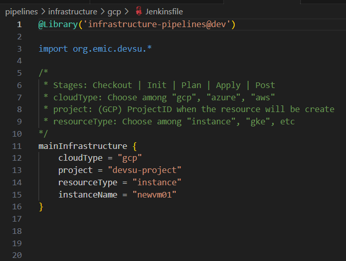
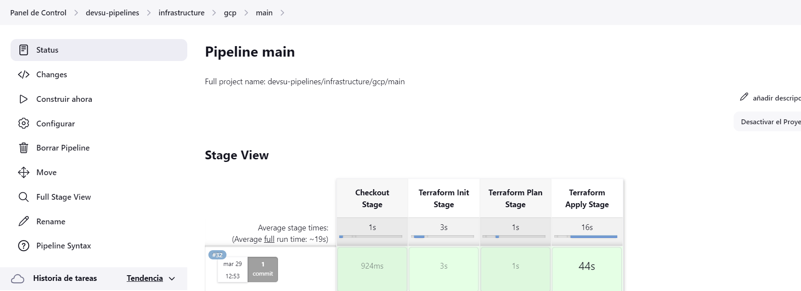
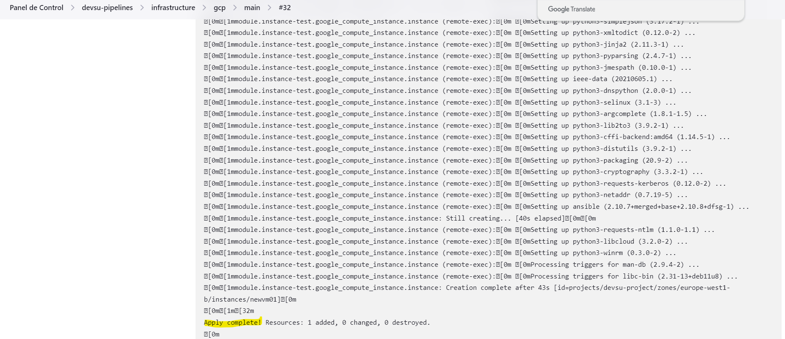
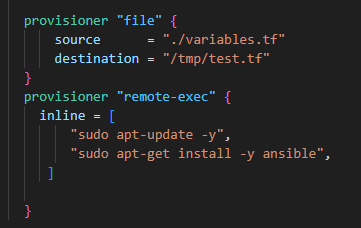
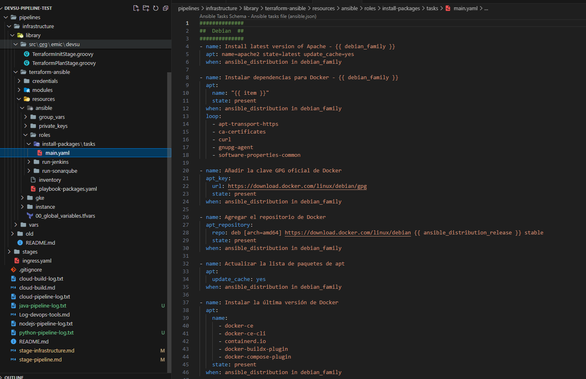
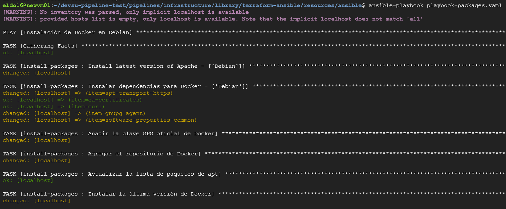
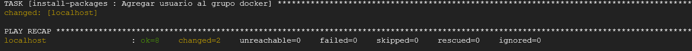

# Registro de ejecución de pipeline
Registro de una muestra de cómo se ejecuta un pipeline para desplegar un recurso en Google Cloud

## 1. Previo a ejecución

## 2. Ejecución

La ejecución del pipeline en Jenkins se ve de la siguiente manera:

En el output del pipeline se puede apreciar que ha desplegado sobre Google Cloud, terminando el Apply del Terraform:

Para ver el log de esta ejecución:
[LOG](cloud-pipeline-log.txt)

## 3. Configuración

Todavía no está incluido en el automatismo, pero se prevee la mejora en esta sección del aprovisionamiento de instancias:

Ya está listo el primer playbook para configurar la instalación de los paquetes básicos:

Ejecución:

