# Registro de ejecución de pipeline
Registro de una muestra de cómo se ejecuta un pipeline para un proyecto Node.js

## 1. Previo a ejecución
### 1.1 Node.js
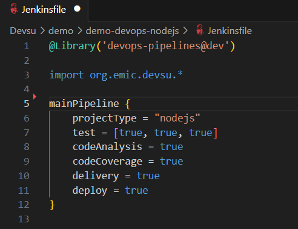

### 1.2 Java
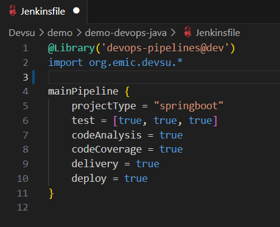

### 1.3 Python
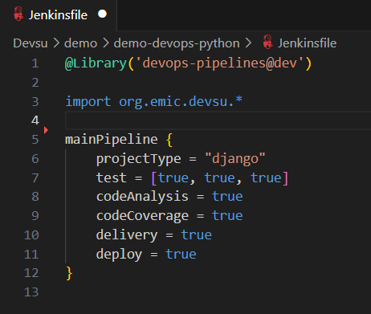

## 2. Ejecución

### 2.1 Node.js
La ejecución del pipeline en Jenkins se ve de la siguiente manera:

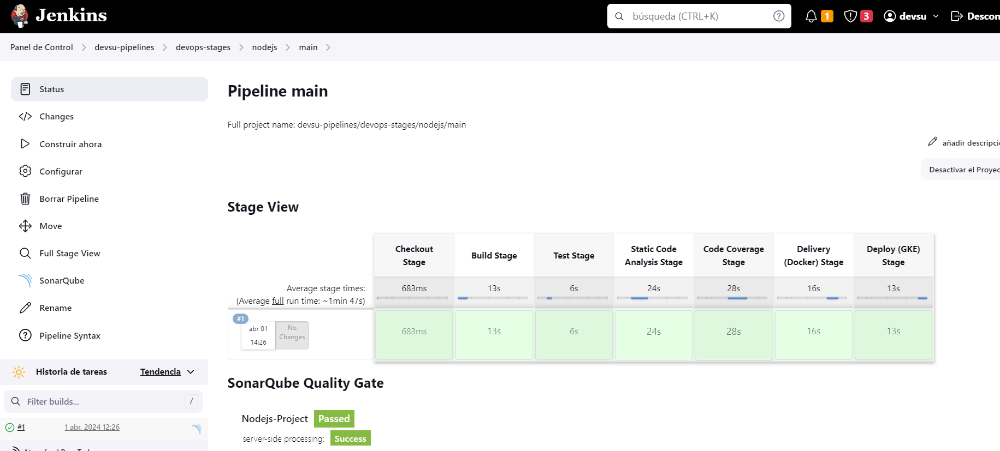

Tal como se indicó en el diagrama de los Stages del Pipeline. Determinados pasos ejecutan y destruyen contenedores docker y otros realizan el análisis de SonarQube. El paso final es el despliegue en Kubernetes, en el clúster de GKE:

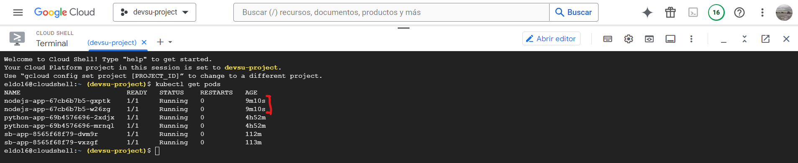

En el output del pipeline también se puede apreciar que estamos desplegando sobre kubernetes:

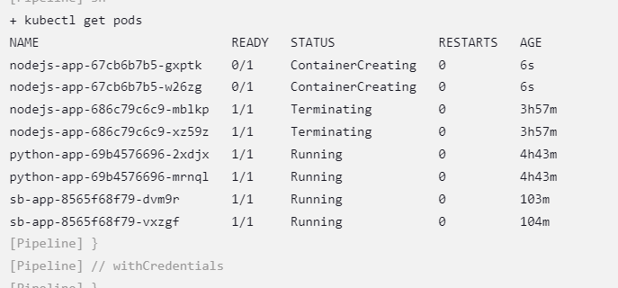

Para ver el log de esta ejecución:
[LOG](nodejs-pipeline-log.txt).

### 2.2 Java
La ejecución del pipeline en Jenkins se ve de la siguiente manera:

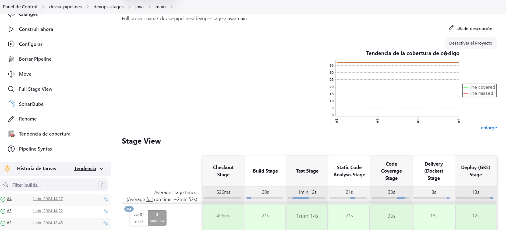

Tal como se indicó en el diagrama de los Stages del Pipeline. Determinados pasos ejecutan y destruyen contenedores docker y otros realizan el análisis de SonarQube. El paso final es el despliegue en Kubernetes, en el clúster de GKE:

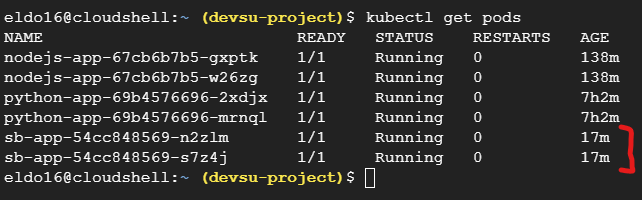

En el output del pipeline también se puede apreciar que estamos desplegando sobre kubernetes:

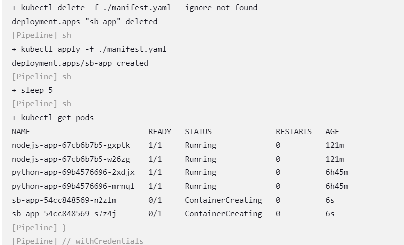

Para ver el log de esta ejecución:
[LOG](java-pipeline-log.txt)

### 2.3 Python
La ejecución del pipeline en Jenkins se ve de la siguiente manera:

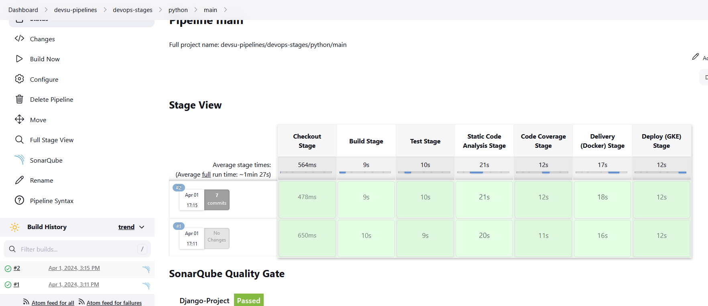

Tal como se indicó en el diagrama de los Stages del Pipeline. Determinados pasos ejecutan y destruyen contenedores docker y otros realizan el análisis de SonarQube. El paso final es el despliegue en Kubernetes, en el clúster de GKE:

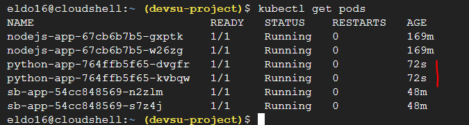

En el output del pipeline también se puede apreciar que estamos desplegando sobre kubernetes:

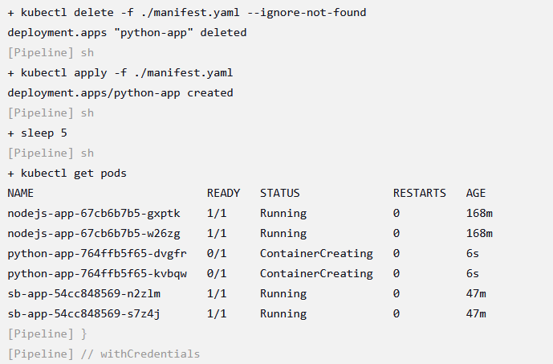

Para ver el log de esta ejecución:
[LOG](python-pipeline-log.txt)